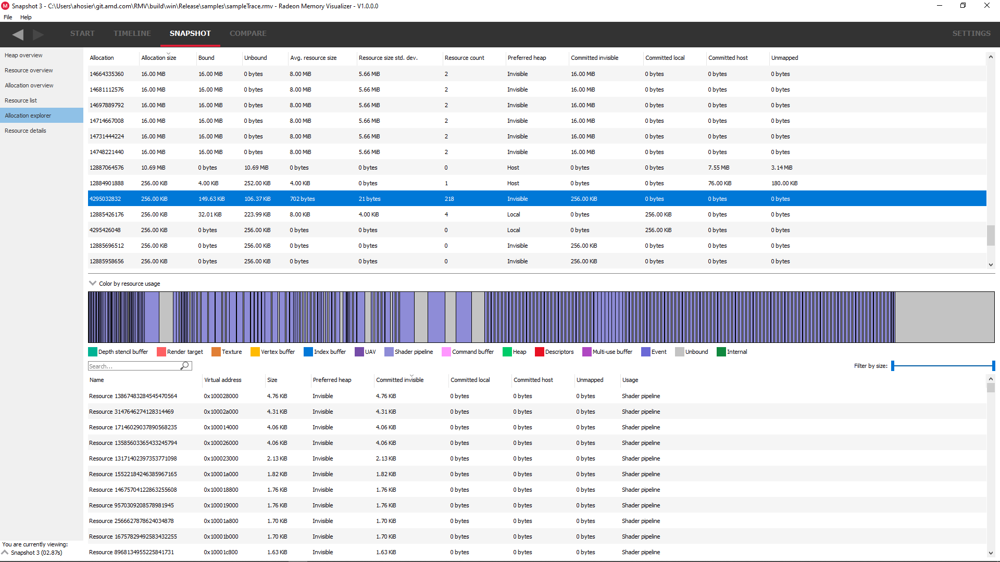

Allocation explorer
-------------------

This will show the resources for each allocation. The pane consists of 2 tables.
The top table lists all of the allocations. Clicking on an allocation will show
it in the graphic below, along with a representation of all of the resources in
the selected allocation. The coloring can be changed using the "**color by ..**"
combo box above the graphic.

The table under the allocation display shows a list of all the resources in the
chosen allocation. These resources can be filtered using the search box text
filter and also by size using the "**Filter by size**" slider on the right.
Double-clicking on a resource will navigate to the **Resource details** pane.

