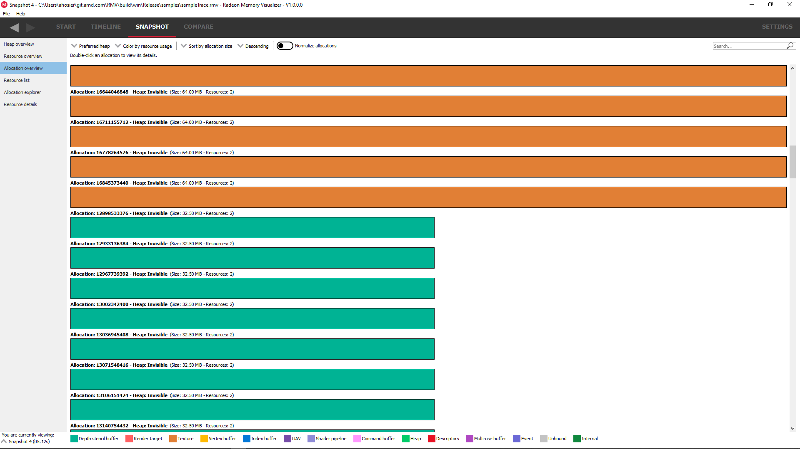
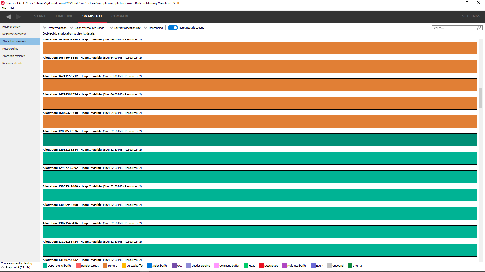

Allocation overview
-------------------

This pane will show the allocations and all the resources in each allocation.
Again, the resources will have a stippled effect if they are aliased.

Filtering by preferred heap is provided so that only resources in the specified
preferred heaps are shown.

The coloring mode can be changed using the 'color by .. ' combo box, which will
color the resources and allocations by various parameters, for example, resource
usage, and the preferred heap type.

The allocations can be sorted using the sort combo box at the top. Sorting is
currently based on allocation size, allocation Id or resource count (the number
of resources in the allocation). Another combo box to the left allows the sort
to be in ascending or decending order.

Normally, allocations are sized relative to the largest allocations. Sometimes
this makes smaller allocations difficult to see. The 'Normalize allocations'
checkbox will draw all allocations the same length, as seen below:

The allocations can also be filtered using the search box. An allocation will
only be shown if any part of its displayed text matches the text in the search
box. This way, allocations can be filtered by size, heap type or number of
resources.

Double-clicking on a resource will jump to the **Allocation explorer**.
