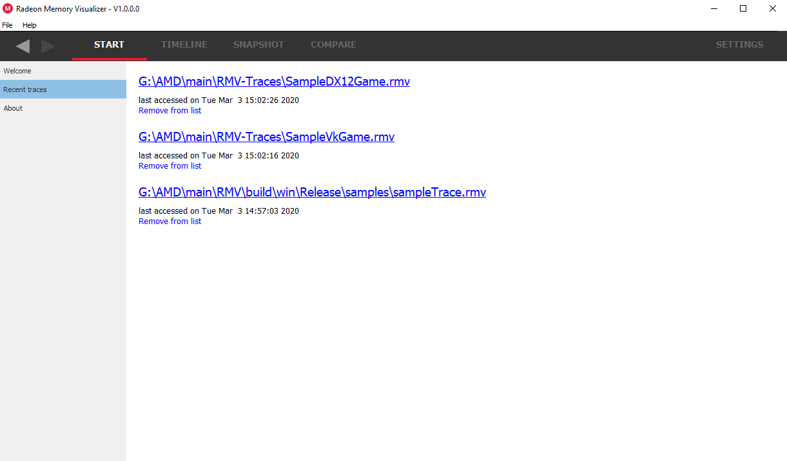
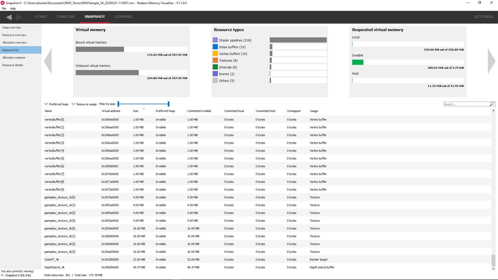

The Radeon™ Memory Visualizer (RMV)
===================================

The Radeon Memory Visualizer is a memory optimization tool that can be used by
developers to optimize memory usage for DirectX12©, Vulkan© applications for
AMD GCN and RDNA hardware.

This document describes how the Radeon Memory Visualizer can be used to
examine a memory trace file. To learn how to generate an RMV trace, please
see https://radeon-developer-panel.readthedocs.io/latest/.

Supported graphics APIs, RDNA and GCN hardware, and operating systems
---------------------------------------------------------------------

**Supported APIs**

-  DirectX12

-  Vulkan

\ **Supported RDNA and GCN hardware**

-  AMD Radeon™ RX 5000 series

-  AMD Radeon™ VII

-  AMD RX Vega 64 and RX Vega 56

-  AMD Ryzen™ 5 3400G/2400G and Ryzen™ 3 3200G/2200G Processors with Radeon Vega Graphics

-  AMD Radeon™ R9 Fury and Nano series

-  AMD Radeon™ RX 400 and RX 500 series

-  AMD Tonga R9 285, R9 380

\ **Supported Operating Systems**

-  Windows 10 only

Radeon Memory Visualizer - Quick Start
======================================

.. include:: capture.rst

Starting the Radeon Memory Visualizer
-------------------------------------

Start **RadeonMemoryVisualizer.exe** (this is the tool used to view memory
trace data).

How to load a trace
-------------------

There are a few ways to load a trace into RMV.

1) Use the “File/Open trace” pull down menu, or the “File/Recent
   trace” pull down menu item.

2) Go to the “Welcome” view and click on the “Open a Radeon Memory
   trace…”

3) Go to the “Welcome” view and click on a trace that you have
   previously loaded in the Recent list.

.. image:: media/welcome_1.png

4) Go to the Recent traces view to see a full list of all your recent traces.

  Notice that there is additional information provided for each trace when
  viewed in this pane, such as the date when the trace was last accessed. It is
  also possible to remove recent traces from the list. Note that they will only
  be removed from the list; they won't be deleted from the file system.

5) Drag and drop a memory trace file onto the **Radeon Memory Visualizer**
   executable, or onto an already open RMV instance.

The Radeon Memory Visualizer user interface
-------------------------------------------

RMV uses the concepts of traces and snapshots. A trace is the file which has
been loaded as described in the previous section. A memory trace file contains
various memory-related events that happened on the GPU over time (memory
allocations, deallocations, binding resources etc). A snapshot is the state of
the GPU at a particular instance in time. Using snapshots, it is possible to
examine which memory has been allocated and where resources can be found. It is
also possible to compare snapshots to look for memory leaks. For example, a
snapshot could be taken before starting a game level and another snapshot taken
after completing the level. Ideally, the 2 snapshots should be the same.

There are four main menus in the Radeon Memory Visualizer and each may have a
number of sub-windows..

1. **Start**

   a. **Welcome** - Shows links to help documentation, and a list of
      recently opened traces, and a sample trace.

   b. **Recent traces** - Displays a list of the recently opened
      traces.

   c. **About** - Shows build information about RMV and useful links.

2. **Timeline**

      Gives an overview of memory consumption over time. Allows for the viewing
      and creation of snapshots

3. **Snapshot**

   a. **Heap overview** - Gives an overview of the heaps available and
      their associated properties

   b. **Resource overview** - Gives an overview of the total resources allocated
      and shows their relative sizes and types

   c. **Allocation overview** - Shows the resources within each allocation

   d. **Resource list** - Shows the properties for all the resource in all
      allocations

   e. **Allocation explorer** - Shows the resources within a chosen allocation

   f. **Resource details** - Display more information about a selected resource

4. **Compare**

   a. **Snapshot delta** - Shows an overview of the differences between one
      snapshot and another

   b. **Memory leak finder** - Shows allocations from each snapshot and how
      those allocations intersect to help locate memory leaks

Settings
========

.. include:: settings.rst

UI Navigation
-------------

In an effort to improve workflow, RMV supports keyboard shortcuts and
back and forward history to quickly navigate throughout the UI.

Back and forward navigation
~~~~~~~~~~~~~~~~~~~~~~~~~~~

RMV tracks navigation history, which allows users to navigate back and
forward between all of RMV’s panes. This is achieved using global
navigation **hotkeys** shown above, or the back and forward **buttons**
on all panes in the top left below the file menu.

Currently, back and forward navigation is restricted to pane switches.

The Timeline windows
====================

.. include:: timeline.rst

Snapshot windows
================

These panes allow the user to analyze single snapshots. The panes can be
accessed from the list on the left hand side. Below the list is a combo
box which allows quick switching between different snapshots.

.. include:: heap_overview.rst

.. include:: resource_overview.rst

.. include:: allocation_overview.rst

.. include:: carousel.rst

.. include:: resource_list.rst

.. include:: allocation_explorer.rst

.. include:: resource_details.rst

Compare windows
===============

These panes allow the user to compare snapshots to see how allocations and
resources have changed over time.

.. include:: snapshot_delta.rst

.. include:: memory_leak_finder.rst

Vulkan resource naming
----------------------
Pipelines, images and buffers can be given unique names and these names will
show up in the RMV UI. The Vulkan extension VK_EXT_debug_utils can be used for this.

For more information, see the document:

https://www.lunarg.com/wp-content/uploads/2018/05/Vulkan-Debug-Utils_05_18_v1.pdf

specifically the section "Naming Objects"

Viewing resource names
----------------------
The resource names will show up in the RMV UI in the resource list pane, for example:

