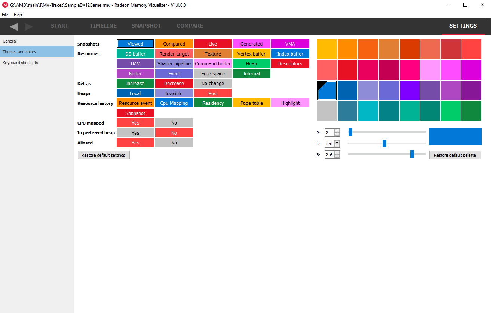
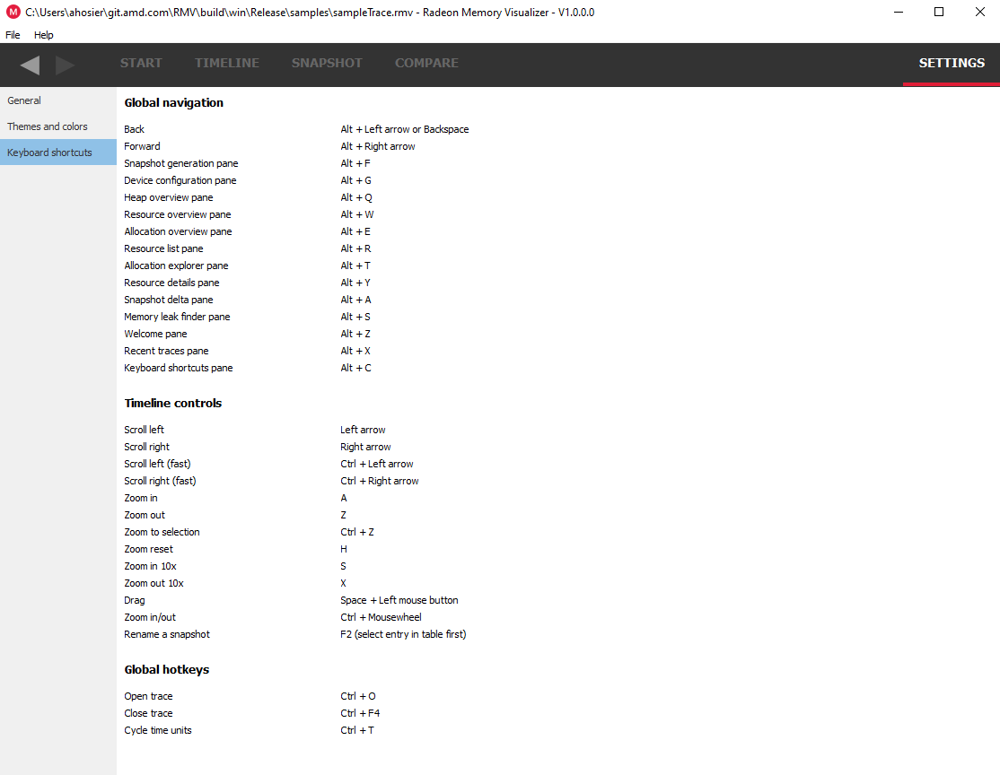

General
-------
**Check for updates** If checked, the Radeon Memory Visualizer will alert you
that a new version is available for download.

Themes and colors
-----------------
The visualizer makes heavy use of coloring to display its information.
This pane allows users to thoroughly customize those colors.

Keyboard shortcuts
------------------

Here users will find the **Keyboard shortcuts** pane:

The **Global navigation** section refers to keystrokes that aid user
navigation, and are always detected regardless of which pane is visible.

The **Timeline controls** shortcuts are specific to zooming and panning
operations that can be performed within the Timeline view (see below).

The **Global hotkeys** section refers to any hotkeys available anywhere in
the product. Currently there are hotkeys to open and close a trace file and
to cycle through the different time units from any pane, rather than having
to go to the settings. This allows you to view a timeline in clock
cycles, milliseconds, seconds or minutes very quickly.

All users are encouraged to adopt these keystrokes while using RMV.
