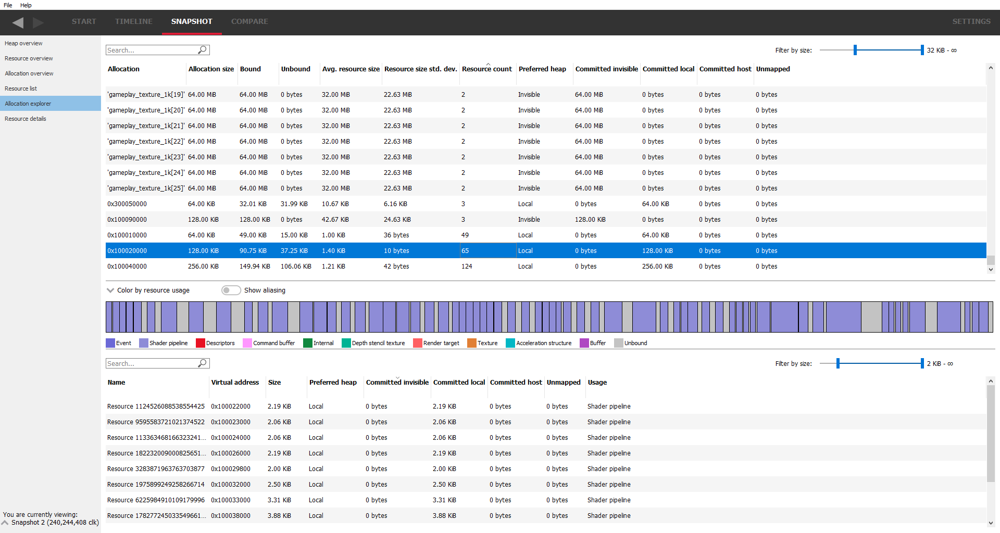
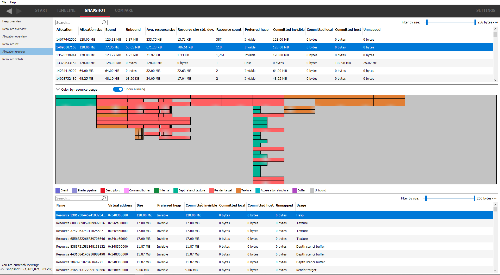

Allocation explorer
-------------------

This will show the resources for each allocation. The pane consists of 2 tables.
The top table lists all of the allocations. These allocations can be filtered
using the search box text filter, located above the allocation table, and also
by size using the "**Filter by size**" slider to the right of the search box.

Clicking on an allocation will show it in the graphic below, along with a
representation of all of the resources in the selected allocation.

Mousing over a memory size cell in either table will display a tooltip showing
the number of bytes.

The coloring can be changed using the "**color by ..**" combo box above the
allocation graphic.

The "**show aliasing**" checkbox will display the resources in the allocation
in a stacked view to help visualize aliasing. If no resources in the allocation
are aliased, the checkbox will be grayed out. There are 2 splitters above and
below the graphical allocation display and these can be moved to increase or
decrease the height of the graphical allocation display. If there is a lot of
aliasing, it may be useful to temporarily increase the height, as shown below:

The table under the allocation display shows a list of all the resources in the
chosen allocation. These resources can be filtered using the search box text
filter and also by size using the "**Filter by size**" slider on the right.
Double-clicking on a resource will navigate to the **Resource details** pane.
