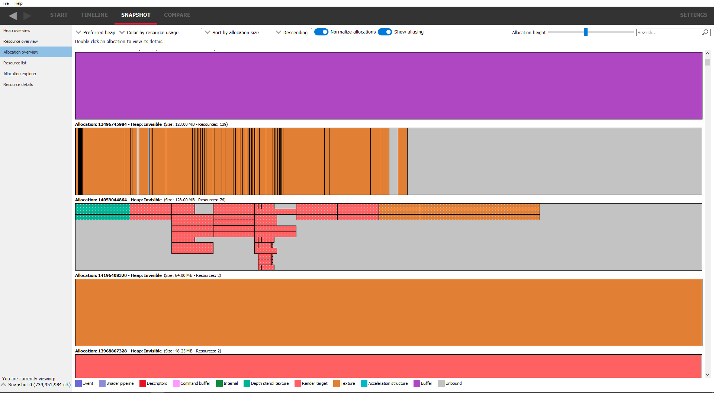

Allocation overview
-------------------

This pane will show the allocations and all the resources in each allocation.
Again, the resources will have a stippled effect if they are aliased.

.. image:: media/snapshot/allocation_overview_1.png

Filtering by preferred heap is provided so that only resources in the specified
preferred heaps are shown.

The coloring mode can be changed using the "**color by ..**" combo box, which will
color the resources and allocations by various parameters, for example, resource
usage, and the preferred heap type.

The allocations can be sorted using the sort combo box at the top. Sorting is
currently based on allocation size, allocation Id, allocation age or resource
count (the number of resources in the allocation). Another combo box to the
left allows the sort to be in ascending or descending order.

Normally, allocations are sized relative to the largest allocations. Sometimes
this makes smaller allocations difficult to see. The 'Normalize allocations'
check box will draw all allocations the same length, as seen below:

Also notice that the allocations are slightly taller than in the previous
screenshot. The allocation height is controlled via the slider at the top,
either allowing more allocations to be visible or showing more detail for
a particular allocation. This is necessary in the case of aliased resources,
where resources share the same underlying memory. The 'Show aliasing' check
box will toggle between showing resources as a stacked display. If aliasing
isn't present, the allocation display will be unchanged. This is demonstrated
below:

Here, there is aliasing on a depth-stencil buffer, and some of the render
targets and textures. Normally these would be shown as single resources as
seen in the previous image, but switching on the aliasing display, it can be
seen that in the case of the depth-stencil buffer, the 3 resources share the
same underlying memory. Also the height of the allocations has been increased
to show the stacking more clearly.

The allocations can also be filtered using the search box. An allocation will
only be shown if any part of its displayed text matches the text in the search
box. This way, allocations can be filtered by size, heap type or number of
resources.

Double-clicking on a resource will jump to the **Allocation explorer**.
