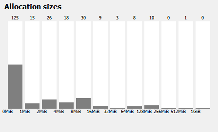
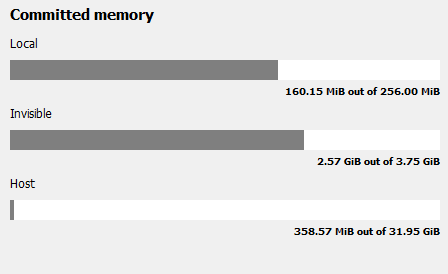
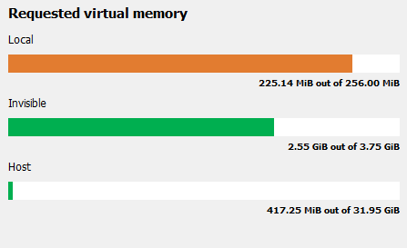
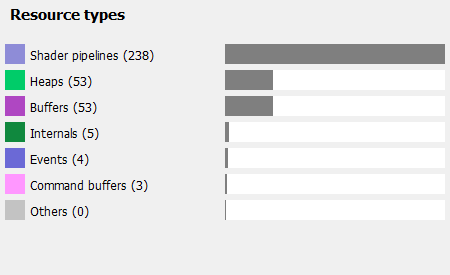
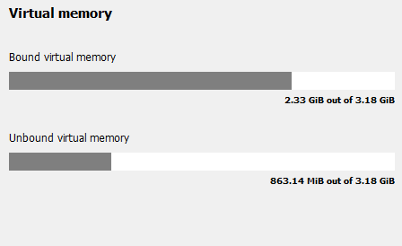

The Carousel
------------

The carousel is displayed on the **Resource list** panes and displays high level
information about the resources in the current snapshot. It can be seen as an
overview to answer high level questions such as 'How much memory in each heap
is my application using?' or 'How large are my allocations?'.

The **Allocation sizes** shows the sizes of allocations arranged in buckets.
It is easy to see at a glance how many allocations are being used and their
relative sizes.

The **Committed memory** shows the amount of memory that this application has
committed to physical memory for each of the heap types. Ideally, all memory
that the application has requested should be in physical memory.

Note that the amount of committed memory displayed across different tabs of RMV is calculated
based on low-level data from the graphics driver and may not directly correspond to memory allocations/deallocations
made using the graphics API.

The **Requested virtual memory** shows which memory was requested from which heap.
The same coloring scheme is used as in the **Heap overview** pane so it is easy to
see if certain heaps are over or undersubscribed.

The **Resource types** shows the makeup of the resources contained within the
allocations. The most popular ones are displayed with everything else bucketed
in the "Other" category.

The **Virtual memory** shows how much memory has resources bound to it. Unbound
memory is effectively unused so should be minimized as much as possible. Sometimes
due to alignment issues this is not possible but if there is a lot of unbound
memory, this will be seen in the *Allocation overview* pane for each allocation.

The carousel is also shown in the **Snapshot delta** pane but here it shows the
differences between the 2 selected snapshots.

