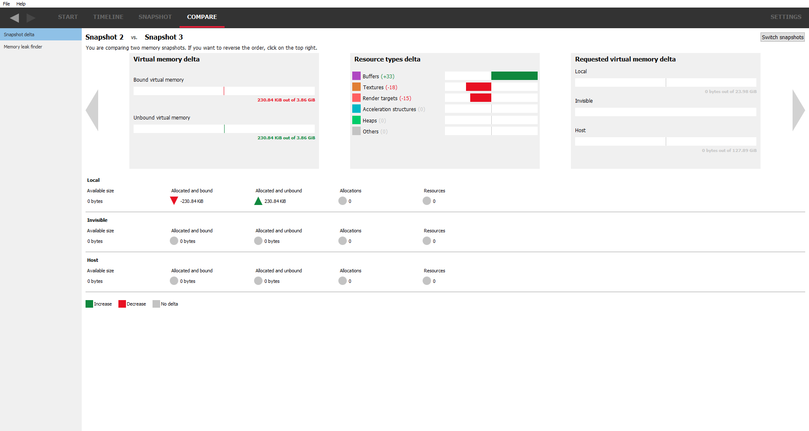
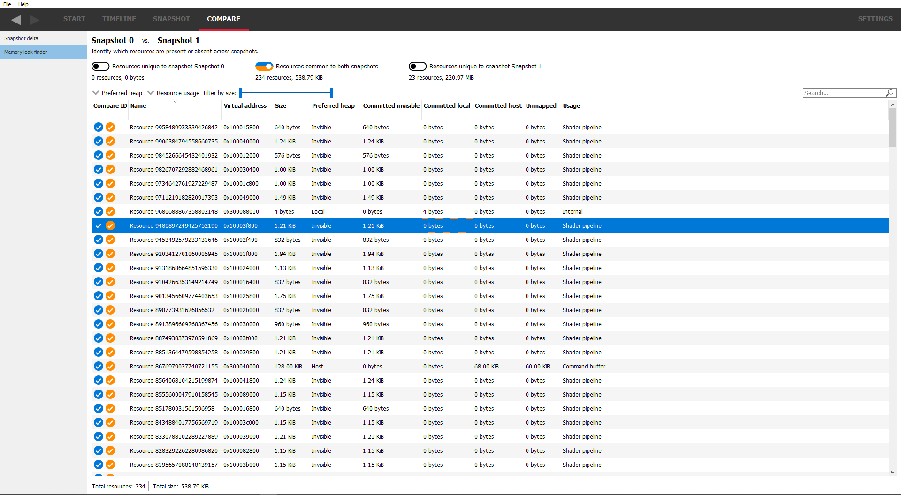
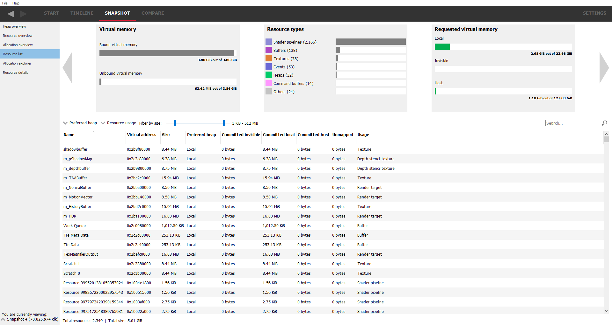

Compare windows
===============

These panes allow the user to compare snapshots to see how allocations and
resources have changed over time.

Snapshot delta
--------------

The snapshot delta gives a high level overview of the differences between two
snapshots. It shows the difference in the number of allocations and resources
for each heap type.

The carousel works in a similar way to the carousel in the **Resource list** pane
but now shows the differences between the 2 snapshots, indicating such things as
whether memory consumption has gone up or down.

The "**Switch snapshots**" button in the top right corner under the settings
tab can be used to switch the snapshots.

Memory leak finder
------------------

This pane shows the list of resources from both snapshots and allows them to be
filtered depending on whether they are unique to one snapshot or present in
both. This filtering can be achieved using the 3 checkboxes at the top. For example,
just selecting the middle checkbox will show resources common to both snapshots.
Underneath each checkbox is a summary of the number of resources that the checkbox
represents and the total amount of memory used for that checkbox. For example, the
left-most checkbox will show resources that are only present in the first snapshot.

As with the other panes, search strings and the "**Filter by size**" slider can be
used to narrow down the list of resources.

Double-clicking on a resource will navigate to the **Resource details** pane and
allow the snapshot to be viewed in the SNAPSHOT tab. If a resource is common to
both snapshots, the base snapshot will be used.

Vulkan resource naming
----------------------
Pipelines, images and buffers can be given unique names and these names will
show up in the RMV UI. The Vulkan extension VK_EXT_debug_utils can be used for this.

For more information, see the document:

https://www.lunarg.com/wp-content/uploads/2018/05/Vulkan-Debug-Utils_05_18_v1.pdf

specifically the section "Naming Objects"

DirectX 12 resource naming
--------------------------
Memory traces for DirectX applications captured with the Radeon Developer Panel
can include unique names for resources like heaps, buffers and textures.  Names can be assigned to
DirectX resources using the ``ID3D12Object::SetName()`` method.
For more information, please review the Microsoft DirectX 12 documentation.

Calling the ``SetName()``
method results in ETW (Event Tracing for Windows) events being emitted and picked
up by the Panel. This resource naming information is then included in the RMV trace
file.

Due to the asynchronous nature of the event tracing, memory events that happen a short time before the process exit
may show up incorrectly in RMV in terms of naming, as well as
marking and filtering out implicit heaps (created for committed resources)
and implicit buffers (that D3D12 runtime creates automatically for every explicitly created heap).
To overcome this problem, it is recommended to introduce a delay of few seconds
between memory events of interest and the process exit.

Viewing resource names
----------------------
The resource names will show up in the RMV UI in the resource list pane, for example:

