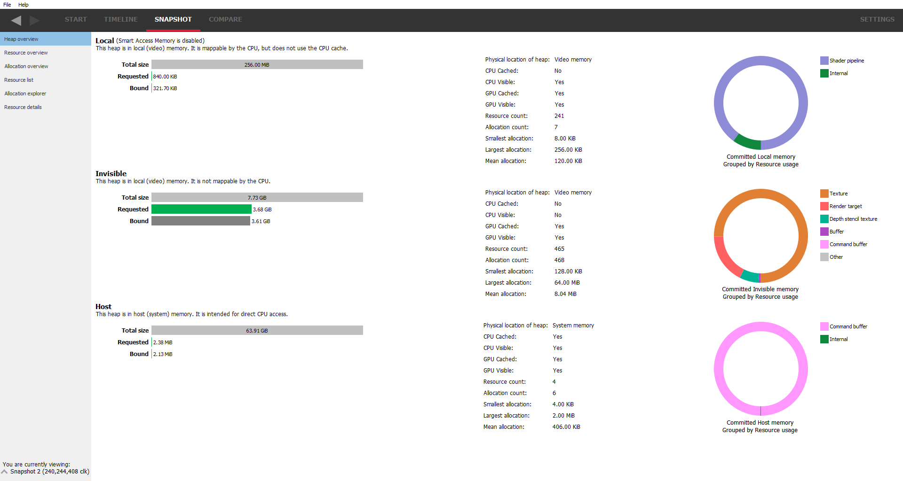

Heap overview
-------------

This is the default snapshot pane that will be displayed after creating a
snapshot. It gives an overview of the amount of memory the application is
using and where that memory is allocated. It can be used to very quickly
determine if the application is using too much memory of a certain type
and if the correct memory type is being used where it should be.

The display is split into 3 sections, one section per heap type. There is
a brief description of the use for each heap.

On the left is the amount of memory used for each heap type as a series
of bar graphs:

The requested bar graph shows how much of that heap was requested by the
application. Just because an application requests memory doesn't automatically
mean the application gets it. If the application requests too much memory,
a warning message is displayed. The bar is also color coded to show whether
the memory type is oversubscibed or is close to being oversubscribed.

The 'total size' bar shows the total amount of physical memory in the heap.

The 'used' bar shows how much memory the application is using in dark gray.
The lighter gray to the right indicates the total amound of memory used by all
processes in the system.

The middle column shows a series of statistics for the heap memory type, such
as where the memory resides (in system or video memory), whether it is mapped
on the CPU and some statistics on the allocations.

The right column shows the makeup of the resource types in each of the heaps.
From this, it can be determined if certain resource types are in the optimum
memory type for the particular resource (maybe there's a render target in system
memory when ideally it should be in local memory).
