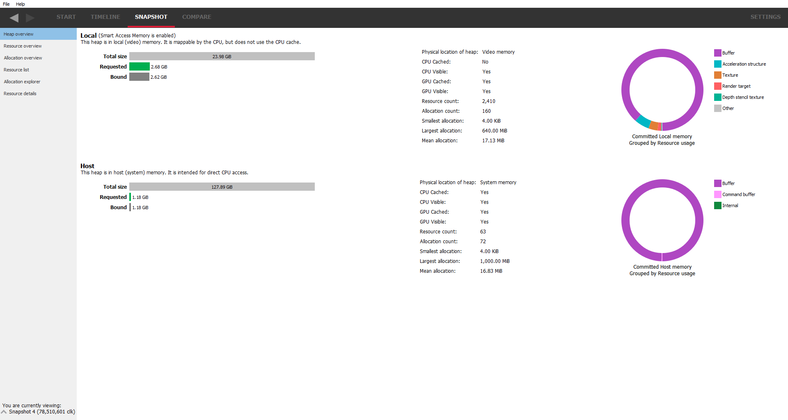

Heap overview
-------------

This is the default snapshot pane that will be displayed after creating a
snapshot. It gives an overview of the amount of memory the application is
using and where that memory is allocated. It can be used to very quickly
determine if the application is using too much memory of a certain type
and if the correct memory type is being used where it should be.

RMV is able to detect if a memory trace was taken from a system with
Smart Access Memory (SAM) enabled. SAM gives the CPU direct access to
all available video memory. More information on SAM can be found in the
GPUOpen article, "How to get the most out of Smart Access Memory" located
at https://gpuopen.com/learn/get-the-most-out-of-smart-access-memory/

The top line of the Heap overview pane indicates if SAM is enabled or
disabled.

When SAM is disabled, the display is split into 3 sections, one section per
heap type. There is a brief description of the use for each heap.

.. image:: media/snapshot/heap_overview_1.png

When SAM is enabled, the section for the invisible heap is not shown since
all memory is visible to the CPU.

On the left is the amount of memory used for each heap type as a series
of bar graphs:

The requested bar graph shows how much of that heap was requested by the
application. Just because an application requests memory doesn't automatically
mean the application gets it. If the application requests too much memory,
a warning message is displayed. The bar is also color coded to show whether
the memory type is oversubscribed or is close to being oversubscribed.

The 'total size' bar shows the total amount of physical memory in the heap.

The "Requested" bar shows how much memory the application has requested. This
should give an indication of the memory footprint of the application.
Memory requests typically request virtual memory under the hood and it is up
to the driver to make sure that virtual memory is mapped to physical memory
when and where appropriate.

The "Bound" bar shows how much memory has been bound to resources. If there is
substantially more requested memory than bound memory, it may indicate that
memory has been requested but is not actually being used by the application.

The "Committed" bar shows how much memory has been mapped to physical memory.
If the amount of committed memory is substantially less than the amount of
memory requested, it may indicate that there are other tasks running on the
system that are consuming memory or the application itself is using more
memory than is physically available.

The middle column shows a series of statistics for the heap memory type, such
as where the memory resides (in system or video memory), whether it is mapped
on the CPU and some statistics on the allocations.

The right column shows the makeup of the resource types in each of the heaps.
From this, it can be determined if certain resource types are in the optimum
memory type for the particular resource (maybe there's a render target in system
memory when ideally it should be in local memory).
