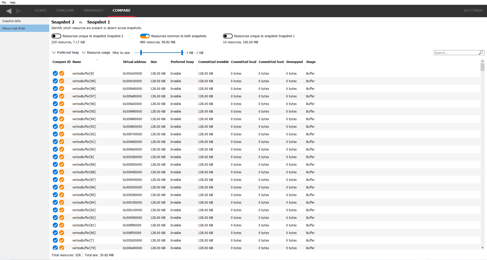

Memory leak finder
------------------

This pane shows the list of resources from both snapshots and allows them to be
filtered depending on whether they are unique to one snapshot or present in
both. This filtering can be achieved using the 3 checkboxes at the top. For example,
just selecting the middle checkbox will show resources common to both snapshots.
Underneath each checkbox is a summary of the number of resources that the checkbox
represents and the total amount of memory used for that checkbox. For example, the
left-most checkbox will show resources that are only present in the first snapshot.

As with the other panes, search strings and the "**Filter by size**" slider can be
used to narrow down the list of resources.

Double-clicking on a resource will navigate to the **Resource details** pane and
allow the snapshot to be viewed in the SNAPSHOT tab. If a resource is common to
both snapshots, the base snapshot will be used.

