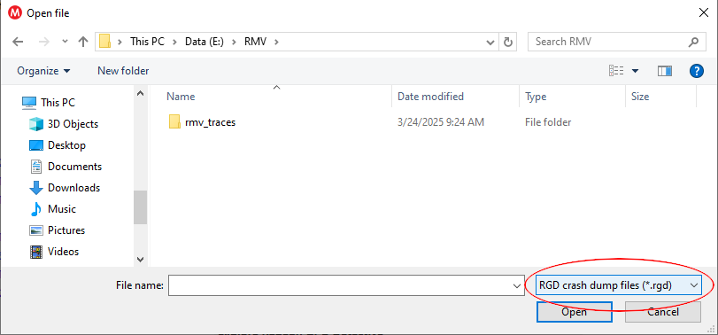
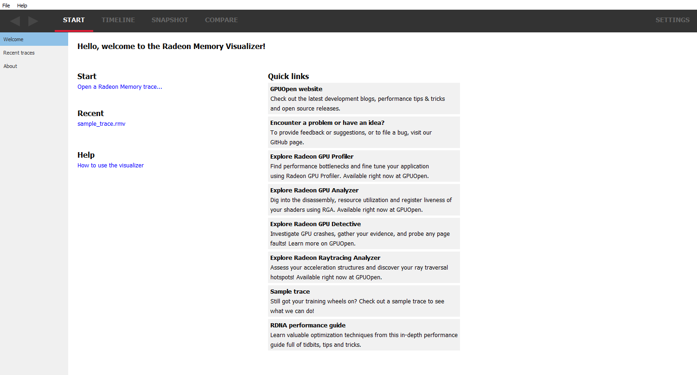
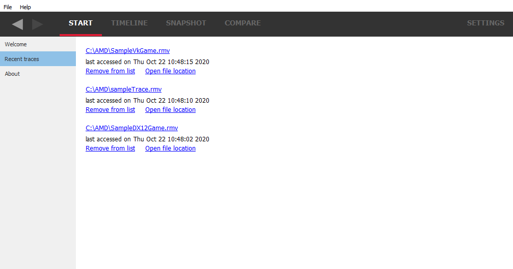

Radeon Memory Visualizer - Quick Start
======================================

How to generate a memory trace
------------------------------

The first thing you will need to do is generate a memory trace. Currently,
this is done via the Radeon Developer Panel. Read the documentation provided
with this distribution for information on how to create a memory trace. This
can be obtained from within the Radeon Developer Panel or from the link on the
Radeon Memory Visualizer “Welcome” view. The documentation is also available
online at:
http://radeon-developer-panel.readthedocs.io/en/latest/

This documentation can also be found online at:
http://radeon-memory-visualizer.readthedocs.io/en/latest/

Starting the Radeon Memory Visualizer
-------------------------------------

Start **RadeonMemoryVisualizer.exe** (this is the tool used to view memory
trace data).

How to load a trace
-------------------

There are a few ways to load a trace into RMV.

1) Use the "File/Open trace" pull down menu, or the "File/Recent
   trace" pull down menu item.
   
  Note that RMV is also capable of loading Radeon GPU Detective (.rgd) files.
  In order to view .rgd file names in the File open dialog box, be sure to select
  "RGD crash dump files (*.rgd)" in the file filter dropdown listbox.  RGD files
  load all the same types of data as RMV files, however, they are opened in
  read-only mode (i.e., created snapshots are not saved).

2) Go to the "Welcome" view and click on the "Open a Radeon Memory
   trace…"

3) Go to the "Welcome" view and click on a trace that you have
   previously loaded in the Recent list.

4) Go to the Recent traces view to see a full list of all your recent traces.

  Notice that there is additional information provided for each trace when
  viewed in this pane, such as the date when the trace was last accessed. It is
  also possible to remove recent traces from the list using the "Remove from list"
  link button. Note that they will only be removed from the list; they won't be
  deleted from the file system. There is also a link button, "Open file location"
  to open the folder where that trace file is on the disk.

5) Drag and drop a memory trace file onto the **Radeon Memory Visualizer**
   executable, or onto an already open RMV instance.

The Radeon Memory Visualizer user interface
-------------------------------------------

RMV uses the concepts of traces and snapshots. A trace is the file which has
been loaded as described in the previous section. A memory trace file contains
various memory-related events that happened on the GPU over time (memory
allocations, deallocations, binding resources etc). A snapshot is the state of
the GPU at a particular instance in time. Using snapshots, it is possible to
examine which memory has been allocated and where resources can be found. It is
also possible to compare snapshots to look for memory leaks. For example, a
snapshot could be taken before starting a game level and another snapshot taken
after completing the level. Ideally, the 2 snapshots should be the same.

There are four main menus in the Radeon Memory Visualizer and each may have a
number of sub-windows..

1. **Start**

   a. **Welcome** - Shows links to help documentation, and a list of
      recently opened traces, and a sample trace.

   b. **Recent traces** - Displays a list of the recently opened
      traces.

   c. **About** - Shows build information about RMV and useful links.

2. **Timeline**

      Gives an overview of memory consumption over time. Allows for the viewing
      and creation of snapshots

3. **Snapshot**

   a. **Heap overview** - Gives an overview of the heaps available and
      their associated properties

   b. **Resource overview** - Gives an overview of the total resources allocated
      and shows their relative sizes and types

   c. **Allocation overview** - Shows the resources within each allocation

   d. **Resource list** - Shows the properties for all the resource in all
      allocations

   e. **Allocation explorer** - Shows the resources within a chosen allocation

   f. **Resource details** - Display more information about a selected resource

4. **Compare**

   a. **Snapshot delta** - Shows an overview of the differences between one
      snapshot and another

   b. **Memory leak finder** - Shows allocations from each snapshot and how
      those allocations intersect to help locate memory leaks