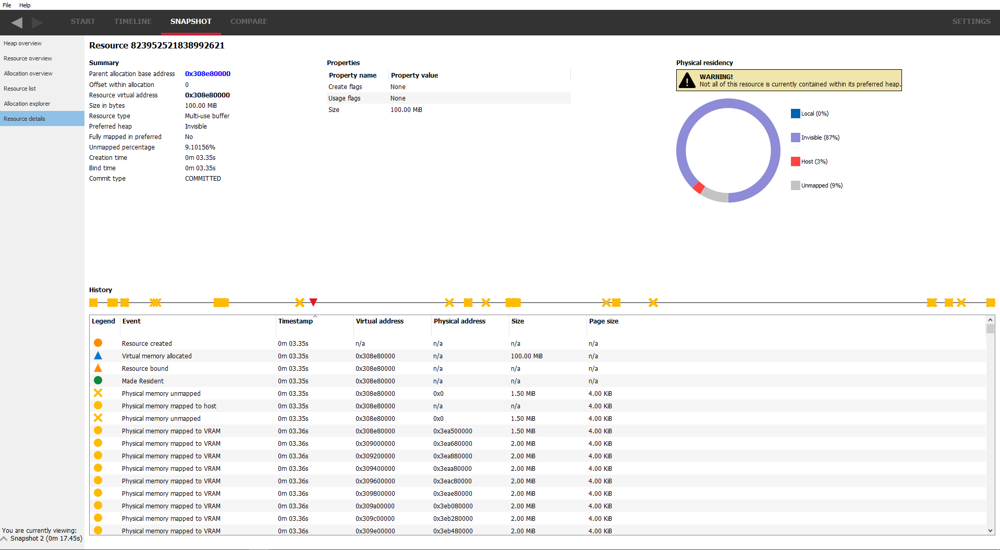

Resource details
----------------

This pane show the information for a selected resource. The pane is in 2 parts.
The top section shows information about the selected resource and is split into
a further 3 sections. To the left is a resource summary showing information about
the resource (its size, which allocation it is in, when it was created etc).

The middle column shows the resource properties which will vary depending on the
resource type. For example, texture resources will show their width, height and
pixel format. Some resources will show create or usage flags. In the case where
these flags are bitfields, the text equivalent of the bitfield will be shown, and
where there are multiple flags, they will be separated with a '|'. The value in
parentheses is the decimal value of the flags.

The right column shows where the texture is resident in physical memory. If it is
not resident, it will be shown as unmapped. From here it can be determined if the
resource is resident in the heap that was requested. If not, a warning message
will appear stating what the problem is.

Underneath the resource info is a timeline showing how the resource changed over
time. The same data is represented in the table below. A marker is also present
showing when the current snapshot was taken. Any events that happened to the
resource after the snapshot are grayed out in the table. This information can
be used in conjunction with the physical residency donut to determine if and
why the resource memory is in a different place than requested (maybe it was
made resident at some point and then paged out).

