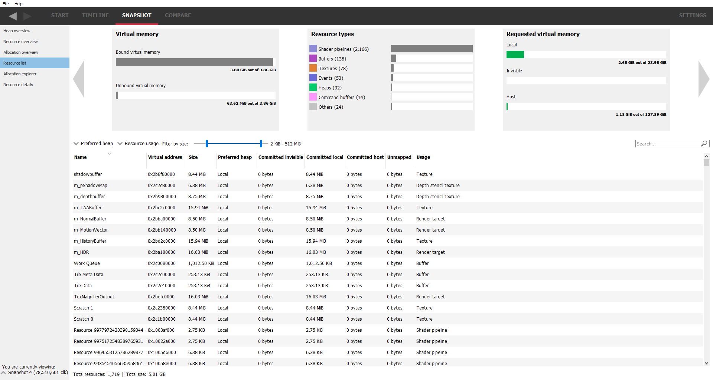

Resource list
-------------

This view will show a list of all the resources in table form for all
allocations.

The top of the view shows the carousel, described earlier.

The preferred heap and resource usage filter combo box can be used to show or
hide resources depending on their resource type or preferred heap type. By
switching all preferred heaps off, some allocations will be left. Orphaned
resources are ones where the parent allocation has been deallocated without
freeing the resource first. Other resources with a '-' don't have a parent
allocation.

The table items can be sorted by selecting one of the column headers. For
example, if the **Preferred heap** column is selected, the whole table will
be sorted by preferred heap.

The search box allows for resources to be filtered by any text which is
present in the table. Any resources which do not match the text filter will not
be displayed.

Searching any of the resource tables in RMV now adds a range-based search in
addition to text searching. For example, if a virtual address is 0x1000 with a
size of 256 bytes, entering the search text as 0x1001 will include this resource
since it is in the address range. This is useful for seeing if memory locations
are used by multiple resources. Range-based searching will work with either
decimal or hexadecimal numbers.

Mousing over a memory size cell in the table will display a tooltip showing the
exact number of bytes.

