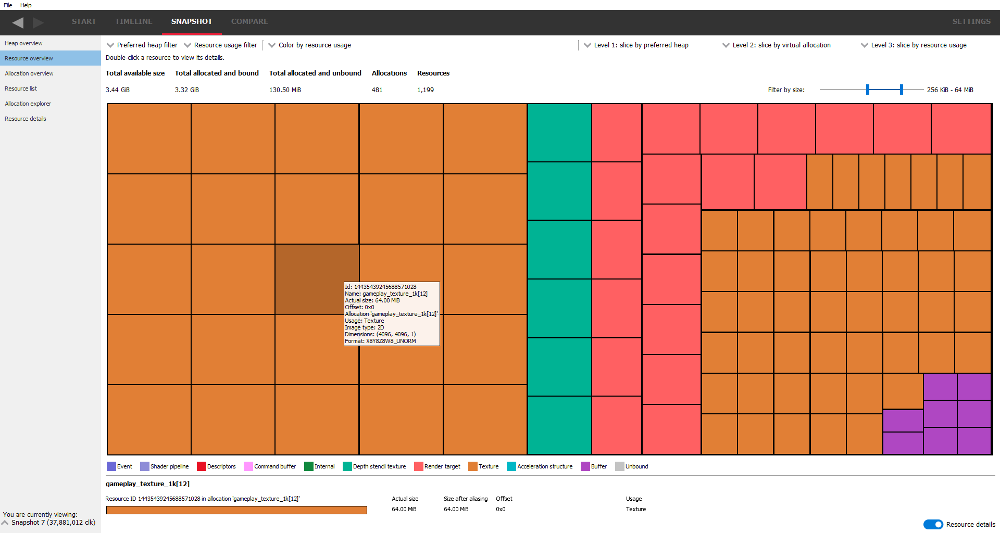

Resource overview
-----------------

This pane will show an overview of the resource used by the application.
Most of the display is occupied by a resource view showing a graphical
representation of the resources in memory. Resources can be filtered out to only
show resources of a particular type or contained in a particular preferred heap.
They can also be color-coded according to various attributes (by resource type
or preferred heap for example).

Mousing over the resources will darken the resource under the mouse, and a
tooltip will show pertinent information for the resource. If resources appear
very small on the screen, the **Filter by size** slider bar can be used to
filter out very large or very small resources.

Clicking on a resource will show details about it at the bottom of the pane,
including various attributes and where the selected resource lies in its
corresponding allocation. Most of this information is now available in the
tooltip.

The preferred heap drop down list allows you to select resources you want to
include in the resource view according to which heap was the preferred container
for the resource at the time the resource was created. You can do this by
checking one or more heaps you wish to include resources from.

The resource usage drop down allows selection of resources according to their
usage type. Again, this is achieved by checking one or more resource types. For
example, unbound resources are not shown by default but this can be changed.

These combo boxes appear on several of the UI's and they are all independent
ie changing heap types on one pane won't affect the heap types on the other
panes that use the heap combo box. Also, the heap selections don't reset when
switching snapshots so that comparisons can quickly be done with the same
configuration. However, loading a new memory trace will reset the heap combo
boxes to their default state. Currently, there are 3 heap types which are
explained a little in the heap overview pane. A fourth heap type in the combo box,
**Unspecified** is used to indicate that this resource does not have a preferred
heap.

The color combo box allows you to color the display depending on various resource
attributes. Examples include coloring by the resource type (the default) or
coloring by resource bind or create times. Using the coloring modes allows you to
instantly see the resources with the same parameters. Most of the coloring modes
are self-explanatory but the 'Commit type' may need some explanation. There are
currently 3 commit types:

Committed
    This means the resource was created with an implicit heap large enough to
    contain it. i.e.: The driver stack is being requested to create a full chain
    of memory mappings down to the physical page.

Placed
    The resource was requested to be a placed resource. This means the resource
    is bound to a previously allocated heap of memory.

Virtual
    The resource was requested to be a virtual resource. This means that there
    is no physical memory backing the resource. The resource will have its own
    virtual address range allocated at the time the resource is created, but
    that virtual address space will not be mapped to an underlaying physical
    address range.

There are also 3 slicing combo boxes. These allow you to group resources by some
attribute. The first slicing mode applies to all the resources. The other 2 slicing
modes are applied to the groups set up by the previous slicing mode.

The screenshot below shows slicing and coloring resources depending whether they
are in the preferred heap. You can tell instantly if resources are where you'd
expect them to be and if not, investigate further by double-clicking on the resource
which will jump to the **Resource details** pane.

.. image:: media/snapshot/resource_overview_2.png

If the resource is displayed with a 'stippled' effect, it means the resource is
aliased indicating that 2 or more resources are sharing the same memory. In the
screenshot below, the stippling effect can be seen on the command buffer.

.. image:: media/snapshot/resource_overview_3.png
