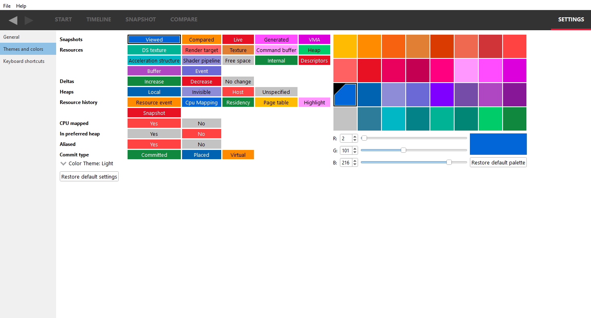
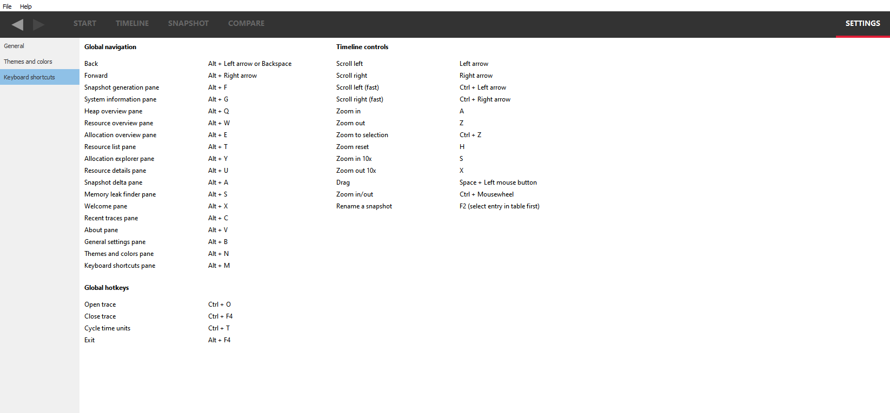

Settings
========

General
-------
**Check for updates** If checked, the Radeon Memory Visualizer will alert you
that a new version is available for download.

**Show Driver experiment notifications** If checked, the Radeon Memory Visualizer
will display a notification banner under the main drop down menu of the user
interface indicating when a loaded memory trace file contains modified Driver
experiments.

Themes and colors
-----------------
The visualizer makes heavy use of coloring to display its information.
This pane allows users to thoroughly customize those colors.

**Color theme:** The color theme can be changed with the "Color Theme" drop down combo box.
This changes the application-wide background and text color. The "Light" option maintains
RMV's default look of white backgrounds with black text. The "Dark" option changes RMV to
have a dark background color with lighter color text. The "Detect OS" option uses the system's
color theme to determine whether the color theme should be light or dark. If the system's
color theme cannot be detected, RMV will default to light theme. If the system's color
theme is changed while RMV is open with the "Detect OS" option selected it will not apply
until the application has been restarted. On Windows operating systems when changing the color
theme a pop-up prompt will recommend restarting the application. This is because not all parts
of RMV will update to a change in color theme until the application is restarted. Changing
the color theme will not change any other color customization options that have been selected.

This is an example of how RMV will look when the color theme is changed to dark:

Keyboard shortcuts
------------------

Here users will find the **Keyboard shortcuts** pane:

The **Global navigation** section refers to keystrokes that aid user
navigation, and are always detected regardless of which pane is visible.

The **Timeline controls** shortcuts are specific to zooming and panning
operations that can be performed within the Timeline view (see below).

The **Global hotkeys** section refers to any hotkeys available anywhere in
the product. Currently there are hotkeys to open and close a trace file and
to cycle through the different time units from any pane, rather than having
to go to the settings. This allows you to view a timeline in clock
cycles, milliseconds, seconds or minutes very quickly.

All users are encouraged to adopt these keystrokes while using RMV.

UI Navigation
-------------

In an effort to improve workflow, RMV supports keyboard shortcuts and
back and forward history to quickly navigate throughout the UI.

Back and forward navigation
~~~~~~~~~~~~~~~~~~~~~~~~~~~

RMV tracks navigation history, which allows users to navigate back and
forward between all of RMV’s panes. This is achieved using global
navigation **hotkeys** shown above, or the back and forward **buttons**
on all panes in the top left below the file menu.

Currently, back and forward navigation is restricted to pane switches.

