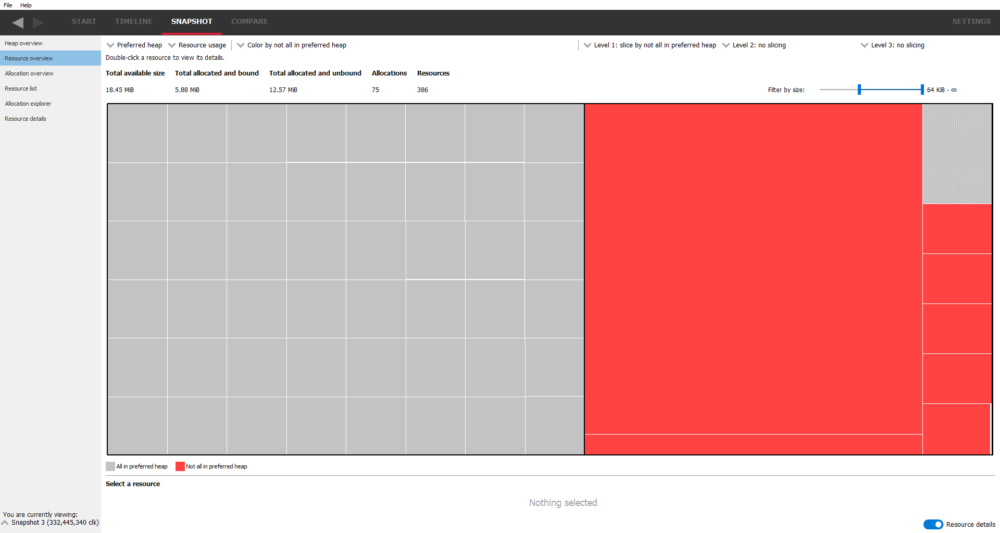
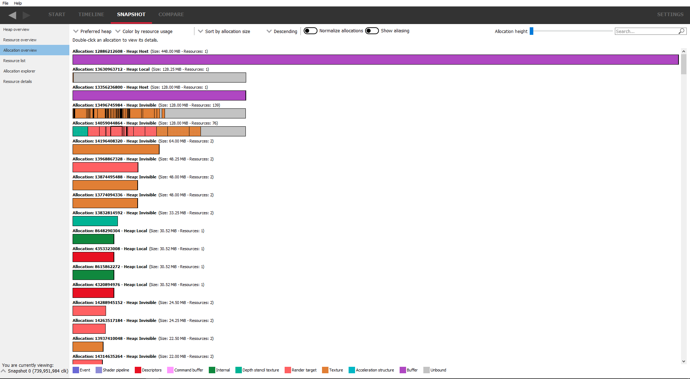
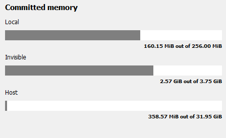
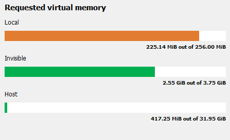
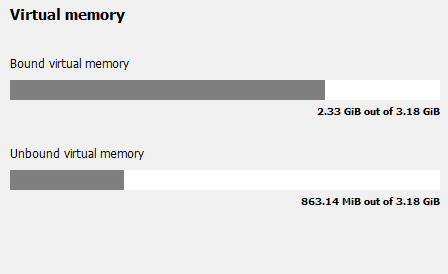
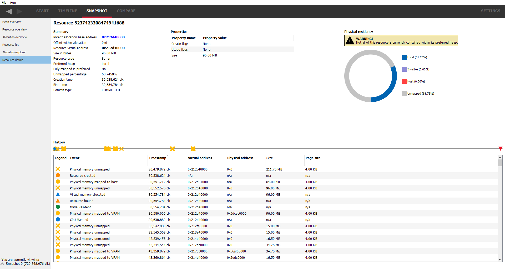

Snapshot windows
================

These panes allow the user to analyze single snapshots. The panes can be
accessed from the list on the left hand side. Below the list is a combo
box which allows quick switching between different snapshots.

Heap overview
-------------

This is the default snapshot pane that will be displayed after creating a
snapshot. It gives an overview of the amount of memory the application is
using and where that memory is allocated. It can be used to very quickly
determine if the application is using too much memory of a certain type
and if the correct memory type is being used where it should be.

RMV is able to detect if a memory trace was taken from a system with
Smart Access Memory (SAM) enabled. SAM gives the CPU direct access to
all available video memory. More information on SAM can be found in the
GPUOpen article, "How to get the most out of Smart Access Memory" located
at https://gpuopen.com/learn/get-the-most-out-of-smart-access-memory/

The top line of the Heap overview pane indicates if SAM is enabled or
disabled.

When SAM is disabled, the display is split into 3 sections, one section per
heap type. There is a brief description of the use for each heap.

.. image:: media/snapshot/heap_overview_1.png

When SAM is enabled, the section for the invisible heap is not shown since
all memory is visible to the CPU.

.. image:: media/snapshot/heap_overview_2.png

Additionally, AMD GPUs based on the RDNA 4 architecture are able to perform
a kind of dynamic smart access memory, making it appear as though all of the GPU
memory is visible to the CPU. In this case, the UI will be shown as if SAM
were enabled (since both methods produce the same result).

On the left is the amount of memory used for each heap type as a series
of bar graphs:

The requested bar graph shows how much of that heap was requested by the
application. Just because an application requests memory doesn't automatically
mean the application gets it. If the application requests too much memory,
a warning message is displayed. The bar is also color coded to show whether
the memory type is oversubscribed or is close to being oversubscribed.

The **"Total size"** bar shows the total amount of physical memory in the heap.

The **"Requested"** bar shows how much memory the application has requested. This
should give an indication of the memory footprint of the application.
Memory is requested when allocations are made e.g. by creating ``ID3D12Heap`` (D3D12)
or ``VkDeviceMemory`` (Vulkan).
Memory requests typically request virtual memory under the hood and it is up
to the driver to make sure that virtual memory is mapped to physical memory
when and where appropriate.
An allocation may not appear in RMV until a first resource is placed in it.

The **"Bound"** bar shows how much memory has been bound to resources, e.g. buffers or textures (images). If there is
substantially more requested memory than bound memory, it may indicate that
memory has been requested but is not actually being used by the application.

The middle column shows a series of statistics for the heap memory type, such
as where the memory resides (in system or video memory), whether it is mapped
on the CPU and some statistics on the allocations.

The right column shows the makeup of the resource types in each of the heaps.
From this, it can be determined if certain resource types are in the optimum
memory type for the particular resource (maybe there's a render target in system
memory when ideally it should be in local memory).

Resource overview
-----------------

This pane will show an overview of the resource used by the application.
Most of the display is occupied by a resource view showing a graphical
representation of the resources in memory. Resources can be filtered out to only
show resources of a particular type or contained in a particular preferred heap.
They can also be color-coded according to various attributes (by resource type
or preferred heap for example).

.. image:: media/snapshot/resource_overview_1.png

Mousing over the resources will darken the resource under the mouse, and a
tooltip will show pertinent information for the resource. If resources appear
very small on the screen, the **Filter by size** slider bar can be used to
filter out very large or very small resources.

Clicking on a resource will show details about it at the bottom of the pane,
including various attributes and where the selected resource lies in its
corresponding allocation. Most of this information is now available in the
tooltip.

The preferred heap drop down list allows you to select resources you want to
include in the resource view according to which heap was the preferred container
for the resource at the time the resource was created. You can do this by
checking one or more heaps you wish to include resources from.

The resource usage drop down allows filtering of resources according to their
usage type. Again, this is achieved by checking or unchecking one or more
resource types. For example, unchecking the Buffer checkbox will hide buffer
resources from the diagram.

In addition to the resource usage types, this drop down combo box also includes
Heap and Unbound checkboxes to show heaps or unbound memory regions on the diagram.
The Heap checkbox selection is mutually exclusive with the resource usage type
checkboxes. The diagram can show either heaps or resource usage types. Note that
the size of heap blocks displayed in the Resource overview diagram are calculated
based on the total actual size. Overlapped resources are not taken into account
when calculating the heap block size. DX12 heaps created implicitly for committed
resources are not shown in this mode.

These combo boxes appear on several of the UI's and they are all independent
ie changing heap types on one pane won't affect the heap types on the other
panes that use the heap combo box. Also, the heap selections don't reset when
switching snapshots so that comparisons can quickly be done with the same
configuration. However, loading a new memory trace will reset the heap combo
boxes to their default state. Currently, there are 3 heap types which are
explained a little in the heap overview pane. A fourth heap type in the combo box,
**Unspecified** is used to indicate that this resource does not have a preferred
heap.

The color combo box allows you to color the display depending on various resource
attributes. Examples include coloring by the resource type (the default) or
coloring by resource bind or create times. Using the coloring modes allows you to
instantly see the resources with the same parameters. Most of the coloring modes
are self-explanatory but the 'Commit type' may need some explanation. There are
currently 3 commit types:

Committed
    This means the resource was created with an implicit heap large enough to
    contain it. i.e.: The driver stack is being requested to create a full chain
    of memory mappings down to the physical page.

Placed
    The resource was requested to be a placed resource. This means the resource
    is bound to a previously allocated heap of memory.

Virtual
    The resource was requested to be a virtual resource. This means that there
    is no physical memory backing the resource. The resource will have its own
    virtual address range allocated at the time the resource is created, but
    that virtual address space will not be mapped to an underlaying physical
    address range.

There are also 3 slicing combo boxes. These allow you to group resources by some
attribute. The first slicing mode applies to all the resources. The other 2 slicing
modes are applied to the groups set up by the previous slicing mode.

The screenshot below shows slicing and coloring resources depending whether they
are in the preferred heap. You can tell instantly if resources are where you'd
expect them to be and if not, investigate further by double-clicking on the resource
which will jump to the **Resource details** pane.

If the resource is displayed with a 'stippled' effect, it means the resource is
aliased indicating that 2 or more resources are sharing the same memory. In the
screenshot below, the stippling effect can be seen on the command buffer.

To help visualize aliased resources, a set of rules are employed to determine which
resource blocks are displayed on the Resource overview pane and size of the blocks
relative to other resources.  When there is an overlap with one or more resources,
the overlapped portion of the resource with the highest priority is displayed.
The priority is based on three factors. The first being the resource usage type
in the order of importance listed in the resource type legend (the leftmost type
is the highest priority and the rightmost is the lowest priority).  If overlapping
resources have the same usage type, they are then compared by size.  The smallest
sized resource has the highest priority.  If the size of the resources is also
the same, the value of the resource identifier is used to make the final decision.

The Allocation overview pane below illustrates aliased resources of mixed usage
types and mixed sizes that are partially overlapping.

Resources overlapped in this way result in the following resource blocks displayed
on the Resource overview pane.

Note that the sum of the aliased resource sizes (2 KiB, 3 Kib 1 KiB and 2 KiB)
total 8 KiB plus the non-aliased resource size of 2 KiB adds up to match the
reported Total allocated and bound size.

Allocation overview
-------------------

This pane will show the allocations and all the resources in each allocation.
Again, the resources will have a stippled effect if they are aliased.

Filtering by preferred heap is provided so that only resources in the specified
preferred heaps are shown.

The coloring mode can be changed using the "**color by ..**" combo box, which will
color the resources and allocations by various parameters, for example, resource
usage, and the preferred heap type.

The allocations can be sorted using the sort combo box at the top. Sorting is
currently based on allocation size, allocation Id, allocation age, resource
count (the number of resources in the allocation) or fragmentation score. The
fragmentation score is simply a measure of how fragmented the allocation is. The
more gaps there are between resources, the higher this value will be.

Another combo box to the
left allows the sort to be in ascending or descending order.

Normally, allocations are sized relative to the largest allocations. Sometimes
this makes smaller allocations difficult to see. The 'Normalize allocations'
check box will draw all allocations the same length, as seen below:

.. image:: media/snapshot/allocation_overview_2.png

Also notice that the allocations are slightly taller than in the previous
screenshot. The allocation height is controlled via the slider at the top,
either allowing more allocations to be visible or showing more detail for
a particular allocation. This is necessary in the case of aliased resources,
where resources share the same underlying memory. The 'Show aliasing' check
box will toggle between showing resources as a stacked display. If aliasing
isn't present, the allocation display will be unchanged. This is demonstrated
below:

.. image:: media/snapshot/allocation_overview_3.png

Here, there is aliasing on a depth-stencil buffer, and some of the render
targets and textures. Normally these would be shown as single resources as
seen in the previous image, but switching on the aliasing display, it can be
seen that in the case of the depth-stencil buffer, the 3 resources share the
same underlying memory. Also the height of the allocations has been increased
to show the stacking more clearly.

The allocations can also be filtered using the search box. An allocation will
only be shown if any part of its displayed text matches the text in the search
box. This way, allocations can be filtered by size, heap type or number of
resources.

Double-clicking on a resource will jump to the **Allocation explorer**.

The Carousel
------------

The carousel is displayed on the **Resource list** panes and displays high level
information about the resources in the current snapshot. It can be seen as an
overview to answer high level questions such as 'How much memory in each heap
is my application using?' or 'How large are my allocations?'.

The **Allocation sizes** shows the sizes of allocations arranged in buckets.
It is easy to see at a glance how many allocations are being used and their
relative sizes.

.. image:: media/snapshot/carousel_allocation_sizes.png

The **Committed memory** shows the amount of memory that this application has
committed to physical memory for each of the heap types. Ideally, all memory
that the application has requested should be in physical memory.

Note that the amount of committed memory displayed across different tabs of RMV is calculated
based on low-level data from the graphics driver and may not directly correspond to memory allocations/deallocations
made using the graphics API.

The **Requested virtual memory** shows which memory was requested from which heap.
The same coloring scheme is used as in the **Heap overview** pane so it is easy to
see if certain heaps are over or undersubscribed.

The **Resource types** shows the makeup of the resources contained within the
allocations. The most popular ones are displayed with everything else bucketed
in the "Other" category.

.. image:: media/snapshot/carousel_resource_types.png

The **Virtual memory** shows how much memory has resources bound to it. Unbound
memory is effectively unused so should be minimized as much as possible. Sometimes
due to alignment issues this is not possible but if there is a lot of unbound
memory, this will be seen in the *Allocation overview* pane for each allocation.

The carousel is also shown in the **Snapshot delta** pane but here it shows the
differences between the 2 selected snapshots.

Resource list
-------------

This view will show a list of all the resources in table form for all
allocations.

The top of the view shows the carousel, described earlier.

The preferred heap and resource usage filter combo box can be used to show or
hide resources depending on their resource type or preferred heap type. By
switching all preferred heaps off, some allocations will be left. Orphaned
resources are ones where the parent allocation has been deallocated without
freeing the resource first. Other resources with a '-' don't have a parent
allocation.

The table items can be sorted by selecting one of the column headers. For
example, if the **Preferred heap** column is selected, the whole table will
be sorted by preferred heap.

The search box allows for resources to be filtered by any text which is
present in the table. Any resources which do not match the text filter will not
be displayed.

Searching any of the resource tables in RMV now adds a range-based search in
addition to text searching. For example, if a virtual address is 0x1000 with a
size of 256 bytes, entering the search text as 0x1001 will include this resource
since it is in the address range. This is useful for seeing if memory locations
are used by multiple resources. Range-based searching will work with either
decimal or hexadecimal numbers.

Mousing over a memory size cell in the table will display a tooltip showing the
exact number of bytes.

.. image:: media/snapshot/resource_list_1.png

Allocation explorer
-------------------

This will show the resources for each allocation. The pane consists of 2 tables.
The top table lists all of the allocations. These allocations can be filtered
using the search box text filter, located above the allocation table, and also
by size using the "**Filter by size**" slider to the right of the search box.

Clicking on an allocation will show it in the graphic below, along with a
representation of all of the resources in the selected allocation.

Mousing over a memory size cell in either table will display a tooltip showing
the number of bytes.

.. image:: media/snapshot/allocation_explorer_1.png

The coloring can be changed using the "**color by ..**" combo box above the
allocation graphic.

The "**show aliasing**" checkbox will display the resources in the allocation
in a stacked view to help visualize aliasing. If no resources in the allocation
are aliased, the checkbox will be grayed out. There are 2 splitters above and
below the graphical allocation display and these can be moved to increase or
decrease the height of the graphical allocation display. If there is a lot of
aliasing, it may be useful to temporarily increase the height, as shown below:

.. image:: media/snapshot/allocation_explorer_2.png

The table under the allocation display shows a list of all the resources in the
chosen allocation. These resources can be filtered using the search box text
filter and also by size using the "**Filter by size**" slider on the right.
Double-clicking on a resource will navigate to the **Resource details** pane.

Resource details
----------------

This pane show the information for a selected resource. The pane is in 2 parts.
The top section shows information about the selected resource and is split into
a further 3 sections. To the left is a resource summary showing information about
the resource (its size, which allocation it is in, when it was created etc).

The middle column shows the resource properties which will vary depending on the
resource type. For example, texture resources will show their width, height and
pixel format. Some resources will show create or usage flags. In the case where
these flags are bitfields, the text equivalent of the bitfield will be shown, and
where there are multiple flags, they will be separated with a '|'. The value in
parentheses is the decimal value of the flags.

The right column shows where the texture is resident in physical memory. If it is
not resident, it will be shown as unmapped. From here it can be determined if the
resource is resident in the heap that was requested. If not, a warning message
will appear stating what the problem is.

Underneath the resource info is a timeline showing how the resource changed over
time. The same data is represented in the table below. A marker is also present
showing when the current snapshot was taken. Any events that happened to the
resource after the snapshot are grayed out in the table. This information can
be used in conjunction with the physical residency donut to determine if and
why the resource memory is in a different place than requested (maybe it was
made resident at some point and then paged out).

Not all events have all the parameters listed in the table. In this case, the
entry will be marked as 'n/a' - not applicable. For example, the physical memory
address isn't applicable for a virtual allocation event.

