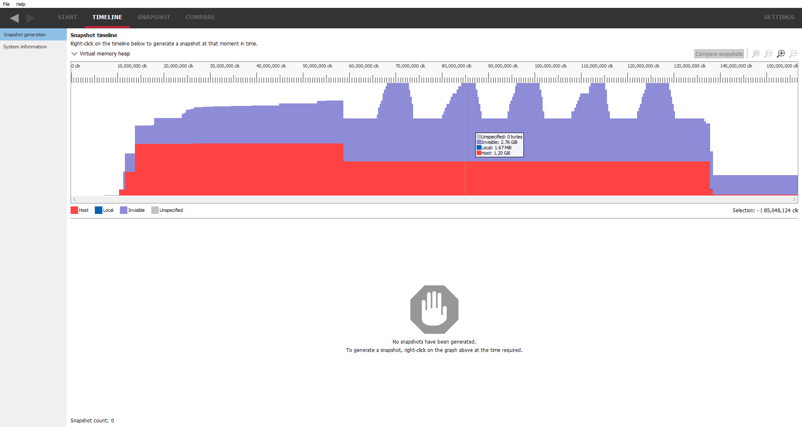

The timeline tab shows the overview of the trace and the system.

Snapshot generation
-------------------
The **Snapshot generation** view will be the first view shown when a memory
trace file has loaded. It will show a graphical representation of the memory
usage over time for a number of processes running on the system, including the
application started by the user. Currently only the user's process is available.

RMV uses the concept of snapshots. A snapshot is the memory state at a
particular moment in time. Using multiple snapshots, it is possible to visualize
how memory is being used by an application over time. It is also possible to
compare snapshots to check to see if memory is being release or whether there
are memory leaks.

Snapshots will be displayed in a table below the timeline graph. If there are
no snapshots contained in the trace, the area under the timeline graph will indicate
that there is nothing to show and offer some guidance of what may be required, as
shown above. There are other instances in the tool showing similar displays,
such as a resource table being empty if the selected allocation contains no
resources, or if a resource type has no additional properties to show.

If snapshots were taken while recording, they will be shown as markers on the
graph and in the table below the graph.

Timeline graph
--------------
The **Timeline graph** displays a visual representation of memory related events
contained in the trace that occurred over a period of time along the horizontal axis.
There are three viewing modes:

1. Virtual memory heap

2. Resource usage count

3. Resource usage size

The viewing mode can be changed by selecting from the combo box above the top-left
of the timeline. Note that with previous releases of RMV, the default Timeline view was
"Resource usage size." The default mode is now "Virtual memory heap."

A color legend below the timeline will indicate what resources are represented by the
colors in the timeline.

When the mouse is over the timeline, the tooltip help will show information
about the memory allocated at the time corresponding to the mouse position. The
time can be seen from the ruler above the graph. The most abundant resources
are listed and the rest are combined in the last entry as "Other."

Starting with release 1.8, RMV takes overlapping resources (i.e., aliased
resources) into account when calculating usage type sizes on the timeline. When
RMV detects multiple resources that are bound to sections of virtual memory that
overlap, the usage size is attributed to the resource with the highest importance.
This is reflected in the height of bars on the "Resource usage size" timeline and
also, the values displayed on the tooltip when the mouse hovers over a point on
the timeline graph. The priority of resource importance's matches the order of 
resource types displayed on the legend below the "Resource usage size" timeline
graph. Resource types towards the left side of the legend have higher priority
and those towards the right have lower priority. In past releases of RMV, the
legend order was reversed. The order of the stacked usage types on the timeline
graph in prior releases was also reversed.

Calculating usage sizes in this way gives a more accurate assessment of memory utilization
and prevents memory from being counted multiple times. For a deeper explanation
of how memory size is calculated for aliased resources, please see the **Resource overview**
section in this document.

The additional usage size calculations required to take aliased resources into
account requires considerably more time to process. For this reason, a Cancel
button has been added below the loading animation while the "Resource usage size"
timeline is being generated. At any time during this processing, the user may
click the Cancel button to revert to the previously displayed timeline mode.

**Zoom controls**

Zoom controls are provided for adjusting the time scale that is viewable on screen
and are displayed in the top right of the timeline pane. These are:

|ZoomSelectionRef| **Zoom to selection**

When **Zoom to selection** is clicked, the zoom level is increased to a selected
region or selected event. A selection region is set by holding down the
left mouse button while the mouse is on the graph and dragging the mouse
either left or right.  A colored overlay will highlight the selected region
on the graph.  For graphs that support it, an event may be selected by
clicking on it with the mouse (either the left or right button).
**Zoom to selection** can also be activated by right clicking on a selection on the
graph and choosing the **Zoom to selection** context menu option.  Zooming
to a selected event can be accomplished by simply double clicking the event.
Pressing the **Z** shortcut key while holding down the **CTRL** key activates
**Zoom to selection** as well.

|ZoomResetRef| **Zoom reset**

When **Zoom reset** is clicked, the zoom level is returned to the original level
to reveal the entire time span on the graph. The zoom level can also be reset
using the **H** shortcut key.

|ZoomInRef| **Zoom in**

Increases the zoom level incrementally to display a shorter time span on the
graph. The zoom level is increased each time this icon is clicked until the
maximum zoom level is reached. Alternatively, holding down the **CTRL** key
and scrolling the mouse wheel up while the mouse pointer is over the graph
will also zoom in for a more detailed view. Zooming in can be activated with
the **A** shortcut key. To zoom in quickly at a 10x rate, press the **S**
shortcut key.

|ZoomOutRef| **Zoom out**

Decreases the zoom level incrementally to display a longer time span on the
graph. The zoom level is decreased each time this icon is clicked until the
minimum zoom level is reached (i.e. the full available time region).
Alternatively, holding down the **CTRL** key and scrolling the mouse wheel down
while the mouse pointer is over the graph will also zoom in for more detailed
view. Zooming out can be activated with the **Z** shortcut key. To zoom out
quickly at a 10x rate, press the **X** shortcut key.

**Zoom panning**

When zoomed in on a graph region, the view can be shifted left or right by using
the horizontal scroll bar.  The view can also be scrolled by dragging the mouse
left or right while holding down the **spacebar** and the left mouse button.
Left and right arrow keys can be used to scroll as well.

**Taking snapshots**

Snapshots can be taken by right-clicking anywhere on the memory graph. This
will bring up a context menu. Clicking on the context menu option "Add
snapshot .." will take a snapshot and add it to the graph and to the snapshot
table below the graph. Notice that only the snapshot name is shown in the
table; the other table entries will be created when the snapshot is viewed.

Clicking on the snapshot in the table or on the timeline will select that snapshot.
Clicking on the **SNAPSHOT** tab with a snapshot selected, or double-clicking on a
snapshot on the table or on the graph will jump to the **Heap overview** pane on
the **SNAPSHOT**. This process will generate the snapshot data at the required
time and returning back to the **Snapshot generation** will now show the table
fully populated for the selected snapshot.

Right-clicking on a snapshot in the table will show a context menu allowing the snapshot
to be renamed or deleted. Snapshots can be renamed using any printable ASCII character,
including spaces. Snapshot names are limited to 32 characters. Snapshots are saved back
to the trace file so they can be viewed at a later date.

Two or more snapshots can be selected in the table by holding down the shift key to
select a range of snapshots or pressing Ctrl to select individual snapshots.
If 2 snapshots are selected, right-clicking on the table while holding down the Ctrl
key will display a context menu to allow them to be compared. Alternatively, the
**Compare snapshots** button in the top right will become active. Clicking on either
will jump to the **Snapshot delta** pane in the **COMPARE** tab. Alternatively, selecting
2 snapshots in the table and clicking on the **COMPARE** tab will do the same thing. The
snapshots will be compared as **base snapshot vs diff snapshot**, where the base snapshot
is the last (or highlighted) snapshot that was selected, and the diff snapshot is the
first snapshot selected. If no snapshot is highlighted or the last snapshot was
deselected (in the case where three snapshots are selected and one of those is
deselected), the snapshots will be compared in the order they appear in the table.

**RGP Interop**

It is possible to take RGP profiles at the same time as capturing an RMV trace. One thing
to bear in mind is that at the point when an RGP profile is taken, the driver will allocate
video memory for the RGP profile data. This can be seen in the RMV memory trace as spikes
on the timeline corresponding to a resource type of 'internal', as seen below.

Device configuration
--------------------
This pane will show some of the parameters of the video hardware on which the
memory trace was taken, showing such things as the name of the video card and
the memory bandwidth.

.. image:: media/device_config_1.png

